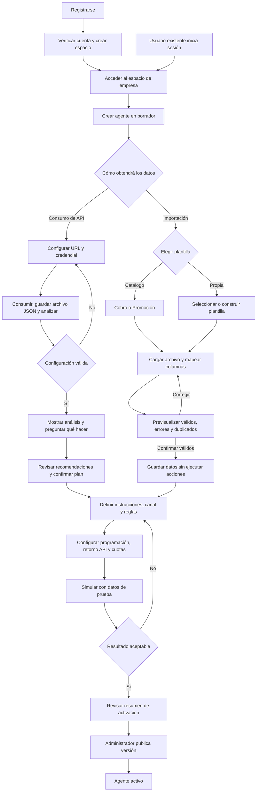
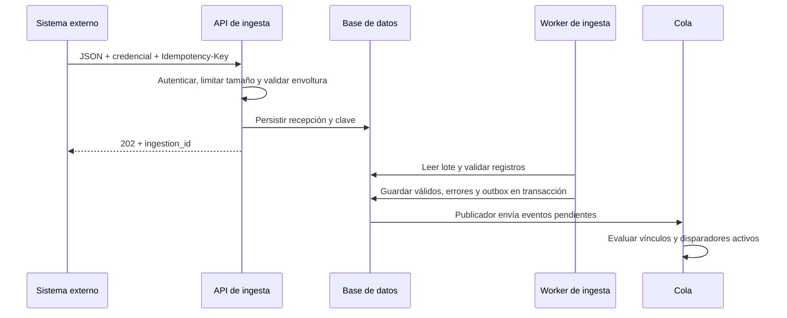
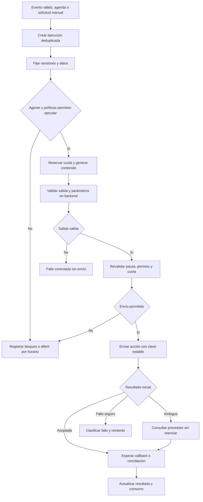

# APPFLOW — Flujos de la aplicación

Versión 0.5 · 2026-09-21. Los nombres técnicos de estado corresponden al TRN y Ciclo API.

Durante todo el asistente: avatar visible → editar paso → autoguardar borrador → validar hitos de la revisión vigente → actualizar porcentaje confirmado → sugerir siguiente paso. Fallo de guardado conserva aviso y porcentaje confirmado anterior. Al volver se restaura el borrador guardado; cambios de dependencias pueden disminuir avance con explicación. Las animaciones acompañan la transición sin retrasar controles. Al 100 % se muestra “Listo para publicar”; la activación sigue requiriendo la acción de publicación. Reglas y pesos en [Configuración del agente](CONFIGURACION-AGENTE.md).

## 1. Configuración y publicación

El registro verificado crea un espacio y asigna al creador como administrador; usuarios existentes entran con su membresía. Editores pueden preparar plantillas, importar y simular; administradores publican agentes. Fallos de archivo, conexión, mapeo, permisos del canal o ausencia de límites mantienen el borrador. Una nueva edición de un agente activo no modifica su versión publicada.

La plantilla define propósito, esquema e instrucciones iniciales. Seleccionarla copia una versión al borrador; construirla permite guardarla para la propia empresa. Cancelar la importación no genera registros operativos ni contactos. Confirmarla conserva las filas válidas; las rechazadas quedan identificadas para corrección. Reimportar en la misma fuente reutiliza IDs estables y no vuelve a contactar automáticamente.

## 2. Ingesta y disparo

### Ciclo API publicado

```mermaid
flowchart LR
    A[Manual o programación] --> B[Consumir API]
    B --> C[Guardar respuesta en archivo JSON]
    C --> D[Analizar con plan publicado]
    D --> E[Preparar acción o batch]
    E --> F[Ejecutar y conciliar acciones]
    F --> G[Generar informe JSON]
    G --> H[Entregar a API de respuesta de empresa]
    H -- Fallo de entrega --> I[Reintentar solo informe]
    I --> H
```

Errores en cualquier etapa generan informe con fallos y pasos omitidos, no desaparecen del historial. Batch previamente preparado empieza desde su snapshot/plan fijado, sin consumo adicional, y revalida vigencia antes de ejecutar. La propuesta POST de retorno y los estados de entrega se describen en [Ciclo API](CICLO-API.md); cada página/intento de consumo genera su archivo o sobre JSON de error.

### Integración JSON entrante conservada

Este diagrama representa la integración JSON avanzada conservada. La llamada saliente a una API converge en el mismo proceso de validación/persistencia. Los registros rechazados nunca se ejecutan. Un lote repetido se consulta con el mismo ID. Registros válidos sin agentes vinculados quedan almacenados sin acciones. Los archivos comparten validación y almacenamiento normalizado, pero necesitan confirmación previa y no emiten disparos automáticos: sus datos se seleccionan en una ejecución manual o programada posterior.

## 3. Ejecución de agente

En simulación se utiliza el mismo mapeo y validación, pero el adaptador de acciones se sustituye por uno sin efectos externos. Puede consumir tokens del modelo, indicados como costo de prueba.

## 4. Mensajes y llamadas

- **Mensaje:** generar contenido → validar destinatario/permiso → solicitar envío → guardar ID del proveedor → esperar entregado o fallido. Si no hay confirmación dentro del plazo, revisión.
- **Llamada MVP:** generar guion → validar destino/horario → solicitar llamada al proveedor → guardar ID → registrar eventos y resultado. No asumir diálogo en tiempo real ni grabación; grabar requerirá una decisión adicional de producto y privacidad.
- **Callback:** verificar autenticidad → resolver acción registrada → deduplicar evento → aplicar transición válida → conciliar costo → actualizar la ejecución. Un callback ajeno, desconocido o inválido nunca cambia recursos de otra empresa.

## 5. Recuperación y control

| Evento | Flujo esperado |
|---|---|
| Se cae un worker antes de enviar | Expira lease, otro worker continúa sobre la misma ejecución/acción |
| Se cae después de posible envío | Conciliar con proveedor; nunca asumir que no se envió |
| Fuente devuelve 401 | Detener reintento automático y solicitar actualización de credencial |
| Proveedor devuelve 429 | Reprogramar según espera indicada y límite de intentos |
| Administrador pausa | Bloquear nuevos envíos; conservar seguimiento de acciones aceptadas |
| Operador cancela | Cancelar pendientes; mostrar cuáles ya no son cancelables |
| Se revoca permiso | Suprimir el próximo envío, incluso si ya estaba en cola |
| Se alcanza cuota | Marcar bloqueo y liberar reservas que no se consumirán |
| Cambia versión publicada | Nuevas ejecuciones usan la nueva versión; existentes conservan la anterior |
| Se solicita reintento manual | Verificar elegibilidad y reutilizar clave de acción; si ambiguo, exigir conciliación |

## 6. Trabajo de los agentes desarrolladores

Proyecto define tarea y aceptación → Fullstack implementa y registra evidencia → QA verifica y registra resultados → Fullstack corrige defectos → QA verifica correcciones → Proyecto consolida estado y pendientes.

Cada transición referencia la tarea, requisitos afectados y entradas de bitácora. Un bloqueo se registra con la información que falta y el responsable de resolverlo. Crear estos documentos no inicia sesiones autónomas de dichos roles.
