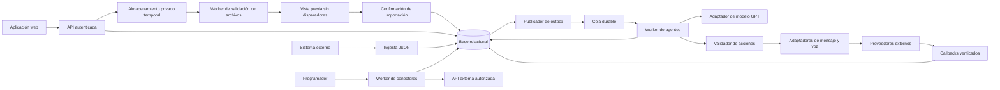

# TRN — Requisitos técnicos

Versión 0.5 · 2026-09-21. Arquitectura propuesta; selección de herramientas pendiente de validación.

Extensión v0.5: [Ciclo API](CICLO-API.md) define almacenamiento duradero de cada consumo en archivo JSON, URL versionada en BD, análisis/recomendaciones, planes, CycleRun, batches, programación e informes entregados al endpoint de la empresa. Sus entidades y rutas complementan este TRN. Los snapshots API no tienen la caducidad de 24 horas propuesta para archivos temporales de importación; su retención se define por separado. Confirmar el archivo antes de permitir análisis/acciones; mantener estado de entrega del informe independiente del resultado del ciclo.

Extensión normativa: [Configuración del agente](CONFIGURACION-AGENTE.md) define campos de borrador, catálogo de avatares, progreso calculado por backend, revisión optimista, evidencias de validación y endpoints de avance/revisión. El porcentaje no se almacena como valor editable por el cliente y la publicación revalida los requisitos. No se agregan proveedores de generación de avatares en este alcance.

## 1. Arquitectura

MVP como monolito modular con API y workers separados. Módulos: registro/identidad/empresas, agentes, plantillas, importaciones, conectores, ingesta, orquestación, canales, auditoría y consumo. Evitar microservicios hasta que exista una necesidad operativa medida.



Tecnologías candidatas: frontend TypeScript, backend TypeScript, PostgreSQL, cola durable y gestor de secretos. Framework, proveedor GPT, infraestructura y versiones se fijan en una decisión técnica antes de implementar. Ningún SDK específico es requisito de esta base.

## 2. Modelo de datos mínimo

Todos los recursos privados de negocio incluyen `tenant_id`, ID opaco y fechas UTC. Referencias entre recursos deben incluir empresa en restricciones compuestas para impedir asociaciones cruzadas. Excepciones explícitas: identidad global del usuario y catálogo de plantillas del sistema, de solo lectura para clientes; nunca almacenan datos privados de una empresa en el catálogo.

| Entidad | Campos y propósito |
|---|---|
| Tenant | nombre, zona horaria, estado, cuotas |
| User / Membership | identidad; asociación usuario-empresa y rol |
| Template / TemplateVersion | alcance system/tenant, categoría, nombre, campos tipados, instrucciones y contenido; versiones publicadas inmutables |
| DataSource | empresa, tipo file/api_pull/api_push y nombre; identidad estable reutilizada al reimportar |
| ImportJob | empresa, fuente, archivo privado, versión de plantilla, mapeo, hash, estado y conteos de vista previa |
| Agent | empresa, nombre, estado, versión publicada |
| AgentVersion | agente, número, modalidad import/api, snapshot de plantilla si aplica, instrucciones, esquema de variables, modelo, límites, configuración de canal; inmutable al publicar |
| Connector / ConnectorVersion | fuente API, método, URL autorizada, mapeo, referencia de secreto, paginación y timeout; versión fijada por AgentVersion |
| SecretReference | referencia al gestor de secretos, estado y metadatos; nunca valor plano |
| AgentSourceBinding | agente, fuente, tipo de disparador y estado |
| Schedule | vínculo, zona horaria, frecuencia, próxima ejecución y política de ejecuciones perdidas |
| IngestionBatch | fuente, clave idempotente, hash, estado, contadores y errores |
| SourceRecord | fuente, external_id, versión del evento, JSON normalizado y hash |
| ContactPermission | identificador de contacto, canal, propósito, estado, origen, fecha y revocación |
| Execution | agente/versión, registro, disparador, clave de deduplicación, estado y correlación |
| Action | ejecución, canal, destinatario protegido, clave idempotente, estado e ID de proveedor |
| ActionAttempt | acción, número, timestamps, error normalizado y respuesta redactada |
| ProviderEvent | ID de evento/proveedor, firma verificada, estado informado y fecha |
| OutboxEvent | evento transaccional, fecha de publicación, intentos |
| UsageLedger | reserva, consumo, ajuste y unidad por empresa/ejecución |
| AuditEvent | actor, recurso, operación, diferencias redactadas y correlación |

Restricciones únicas: `(tenant_id, source_id, ingestion_key)`, `(tenant_id, source_id, external_id, event_version)`, `(tenant_id, execution_dedupe_key)` y `(tenant_id, provider, provider_event_id)`. IngestionBatch y SourceRecord referencian DataSource para admitir archivos y APIs. La deduplicación de acciones también usa una clave estable independiente del número de intento.

## 3. Contratos de API propuestos

Prefijo `/api/v1`. El servidor deriva la empresa de la sesión o credencial de servicio y comprueba pertenencia en cada operación; nunca confía en un `tenant_id` enviado en el JSON.

| Método y ruta | Uso |
|---|---|
| POST /auth/register | Solicitar registro con respuesta que no revele cuentas existentes |
| POST /auth/verify, /auth/resend-verification | Verificar correo mediante token de un uso o solicitar reenvío limitado |
| POST /auth/login, /auth/logout | Iniciar o cerrar sesión mediante proveedor de identidad seleccionado |
| POST /auth/recovery, /auth/reset | Solicitar y completar recuperación con token temporal de un uso |
| POST /onboarding | Crear espacio y membresía administrador una sola vez para la identidad verificada |
| GET, POST /templates | Consultar catálogo autorizado o crear plantilla privada |
| GET, PATCH /templates/{id} | Leer plantilla autorizada o editar borrador privado |
| POST /templates/{id}/publish | Crear versión reutilizable inmutable; editor o administrador, sin activar agentes |
| POST /agents/{id}/apply-template | Copiar una versión autorizada al borrador del agente |
| GET /templates/{id}/sample-file | Generar encabezados y ejemplo sintético del esquema |
| POST /imports | Subir archivo a fuente autorizada y crear trabajo de vista previa; requiere Idempotency-Key |
| PATCH /imports/{id} | Ajustar hoja/mapeo y regenerar vista previa mientras no esté confirmado |
| GET /imports/{id} | Consultar vista previa paginada, revisión y errores por fila |
| POST /imports/{id}/confirm | Confirmar revisión exacta de vista previa e incorporar válidos sin activar acciones |
| POST /imports/{id}/cancel | Cancelar importación aún no confirmada |
| GET /me | Usuario, empresas permitidas y rol activo |
| GET, POST /agents | Listar o crear agentes |
| GET, PATCH /agents/{id} | Consultar o editar borrador |
| POST /agents/{id}/publish | Validar y publicar versión |
| POST /agents/{id}/pause | Pausar nuevas acciones |
| POST /agents/{id}/resume | Reanudar tras validar versión publicada, configuración y límites |
| POST /agents/{id}/archive | Archivar sin borrar historial |
| POST /agents/{id}/simulate | Prueba sin efectos externos |
| POST /agents/{id}/executions | Solicitar ejecución real de versión publicada |
| GET, POST /connectors | Listar o crear conectores |
| PATCH /connectors/{id} | Crear revisión de configuración |
| POST /connectors/{id}/test | Validar conectividad y muestra sin guardar secretos en respuesta |
| POST /connectors/{id}/sync | Solicitar importación manual |
| POST /ingestions/{connector_id} | Recibir lote JSON mediante credencial de ingesta limitada a la fuente |
| GET /ingestions/{id} | Consultar conteos, rechazos y progreso |
| GET, POST /schedules | Consultar o crear programación |
| PATCH /schedules/{id} | Modificar o desactivar programación |
| GET /executions | Consultar historial filtrado y paginado |
| GET /executions/{id} | Detalle, acciones e intentos |
| POST /executions/{id}/cancel | Cancelar trabajo aún no enviado |
| POST /executions/{id}/retry | Reintentar solo acciones elegibles, manteniendo deduplicación |
| GET, POST /contact-permissions | Consultar o registrar permiso con evidencia |
| POST /contact-permissions/{id}/revoke | Revocar y suprimir futuros envíos |
| GET, POST, PATCH /memberships[/{id}] | Administrar miembros y roles, según método |
| GET, POST /secrets | Listar metadatos o registrar secreto; nunca retornar su valor |
| POST /secrets/{id}/rotate | Rotar valor protegido |
| GET, PATCH /tenant-settings | Configurar zona horaria y límites dentro del máximo permitido |
| GET /audit-events | Auditoría paginada |
| POST /provider-events/{provider} | Recibir callback con autenticación del proveedor |

Ejemplo de ingesta; nombres y teléfonos son datos ficticios:

```http
POST /api/v1/ingestions/con_demo
Authorization: Bearer <credencial-de-ingesta>
Idempotency-Key: import-demo-001
Content-Type: application/json
```

```json
{
  "schema_version": "1",
  "records": [
    {
      "external_id": "cita-demo-001",
      "event_version": "1",
      "data": {
        "nombre": "Contacto de prueba",
        "telefono": "+15555550100",
        "fecha_cita": "2026-10-01T15:00:00Z"
      }
    }
  ]
}
```

Respuesta `202`: `{"ingestion_id":"ing_demo","status":"received","correlation_id":"cor_demo"}`. Significa recepción, no validación completa ni envío. La consulta posterior devuelve `completed`, `partial` o `rejected`, conteos y errores por índice/external_id.

El esquema externo exige `schema_version`, `records`, `external_id`, `event_version` y `data`. La validación de campos de `data` depende del mapeo publicado. Un lote puede aceptar registros válidos y rechazar otros; solo los válidos originan eventos. JSON malformado rechaza el lote entero. Propuesta de límites iniciales: 1 MiB y 100 registros por petición; excedentes devuelven `413`.

Repetir clave y contenido devuelve el mismo recurso, sin reejecutar; repetir clave con otro hash devuelve `409`. Conservar claves al menos tanto como el horizonte de reintento/retención acordado. Una nueva versión de evento permite una nueva evaluación, sujeta a reglas de frecuencia de contacto.

Errores: `{"error":{"code":"VALIDATION_ERROR","message":"Campo requerido","details":[{"field":"records[0].external_id","reason":"required"}]},"correlation_id":"cor_demo"}`. Usar `400` formato, `401` autenticación, `403` rol, `404` recurso ausente o de otra empresa, `409` conflicto, `422` configuración semántica, `429` límite y `503` indisponibilidad temporal. Listados usan cursor y límite máximo.

## 4. Conectores y ejecución

### Registro, plantillas e importación

Propuesta de registro: identidad con correo verificado; onboarding transaccional e idempotente crea Tenant y Membership administrador. Repetir onboarding devuelve el mismo espacio inicial. Verificación/recuperación usan tokens con vencimiento y un solo uso, límites de solicitudes y respuestas sin enumeración de cuentas. El mecanismo concreto se adapta al proveedor de identidad que se elija.

El agente fija `input_mode=import|api`. Las plantillas del sistema son de solo lectura; editores y administradores pueden crear plantillas privadas y aplicarlas a borradores. Publicar una plantilla no publica agentes. La versión del agente conserva una copia de campos/instrucciones, por lo que cambios futuros de plantilla no afectan agentes existentes. Plantillas nunca contienen credenciales ni listas reales de contactos.

Importación propuesta: CSV UTF-8 y XLSX sin macros, máximo inicial 10 MiB y 10 000 filas por trabajo. Los límites de archivo son independientes del endpoint JSON. Seleccionar una hoja de XLSX; tratar celdas como datos, sin evaluar fórmulas ni vínculos externos, y marcar fórmulas como error de celda. Validar tipo real, tamaño descomprimido y límites de procesamiento. Almacenamiento temporal privado con acceso por empresa y limpieza propuesta a las 24 horas; retención final pendiente de DEC-06/DEC-08.

La vista previa fija archivo, versión de plantilla, hoja y mapeo mediante una revisión. Confirmar exige esa revisión; cambios posteriores invalidan una confirmación obsoleta con `409`. Mostrar aceptables, rechazados y duplicados; solo filas válidas confirmadas pasan a SourceRecord. No producir eventos ejecutables de agentes al confirmar archivos. Una confirmación repetida devuelve el mismo resultado. Si vence el archivo, pedir cargarlo de nuevo conservando plantilla y mapeo.

Requerir una columna ID estable mapeada a `external_id`; nunca deduplicar solo por número de fila. Dentro de una misma fuente, mismo ID y hash normalizado es un registro sin cambios; contenido distinto produce nueva revisión con `event_version` derivada del hash. IDs repetidos dentro de un archivo se muestran como conflicto y sus filas se excluyen hasta corregirlos. Confirmar una actualización tampoco activa contactos: ejecución manual/programada debe seleccionar el conjunto confirmado y aplicar deduplicación/frecuencia. Persistir confirmación y registros atómicamente o mediante staging con promoción atómica para que no queden lotes parcialmente visibles por una caída.

### Consumo de API

Configuración del conector: URL base y rutas permitidas, GET/POST, headers no secretos, referencia de credencial, parámetros, ruta del arreglo en respuesta, mapeo declarativo, timeout y paginación explícita. No ejecutar expresiones arbitrarias. Propuesta: timeout de 15 segundos, respuesta máxima de 5 MiB, 100 páginas por sincronización; si se alcanza el límite, reportar importación incompleta y conservar checkpoint.

El programador adquiere un bloqueo por programación y genera una clave por ventana. Una ejecución perdida se consolida en una sola sincronización al recuperar el servicio; no reproduce todas las ventanas. Actualizar el cursor solo al persistir la página y sus eventos. Releer la página debe ser seguro por deduplicación.

Una transacción guarda registros y outbox. Un publicador entrega eventos a la cola con semántica al menos una vez. Workers adquieren trabajo con lease recuperable y usan restricciones únicas para impedir acciones duplicadas. No se promete entrega exactamente una vez de extremo a extremo.

El worker fija versión de agente, fuente, conector si aplica y datos; valida permiso de contacto, exclusión, horario, presupuesto y herramientas. Solicita salida estructurada al modelo, valida esquema y aplica políticas en código. La salida del modelo no autoriza acciones por sí misma. El validador vuelve a comprobar pausa, exclusión y cuota inmediatamente antes del envío.

## 5. Estados y recuperación

- Agente: `draft → active ↔ paused → archived`. Editar uno activo genera borrador; publicar cambia la referencia de versión, sin alterar ejecuciones existentes. Reanudar exige una versión publicada válida.
- Ingesta: `received → processing → completed | partial | rejected`.
- Importación de archivo: `uploaded → validating → preview_ready → confirming → completed | partial`; puede terminar `rejected` por archivo inválido, `cancelled` antes de confirmar o `expired` por vencimiento. `partial` significa que se incorporaron todos los válidos confirmados y se excluyeron los rechazados; no una transacción incompleta. La vista previa no es una ingesta activa.
- Ejecución: `queued → running → waiting_provider → succeeded | partially_succeeded | failed | needs_review`; también puede quedar `blocked` por políticas o `cancelled` antes del envío. Desde `running` puede terminar directamente sin proveedor. Un reintento elegible puede regresar a `queued` con registro del intento.
- Acción: `planned → sending → accepted → delivered | completed | failed`; timeout ambiguo: `unknown → accepted | delivered | completed | failed | needs_review`. Mensajes usan `delivered`; llamadas, `completed` con resultado contestada/no contestada/ocupada. `skipped` identifica una acción descartada por política.

`succeeded` exige resultado confirmado de las acciones requeridas; `partially_succeeded` exige al menos una exitosa y otra fallida/omitida. Aceptación sin confirmación mantiene `waiting_provider`; vencido el plazo específico del canal pasa a `needs_review`. Resultado de llamada completada no equivale a que el objetivo comercial se logró.

Reintentos propuestos: máximo 3 intentos con backoff y jitter para fallos transitorios seguros. Respetar `Retry-After`; no reintentar credenciales inválidas ni errores permanentes. Si hubo timeout tras posible aceptación, consultar al proveedor por clave/ID antes de reenviar. Sin idempotencia ni conciliación del proveedor, dejar `needs_review` y prohibir reenvío automático. Los callbacks se deduplican, verifican y no retroceden estados finales por llegada fuera de orden.

## 6. Seguridad y privacidad

- Identidad autenticada, control de roles en backend y filtros de empresa en consultas y trabajos. Aplicar políticas de filas como defensa adicional si la tecnología elegida lo permite.
- Secretos cifrados mediante gestor dedicado; resolverlos solo en backend, rotarlos y ocultarlos en logs, UI y respuestas. Publicaciones fijan referencia; rotación no revela valores históricos.
- Conectores solo HTTPS y destinos autorizados. Bloquear loopback, redes privadas, link-local y endpoints de metadatos, también tras resolver DNS y en cada redirección. Limitar salida de red; no aceptar proxies arbitrarios.
- Callbacks verifican firma, timestamp y protección de replay conforme al proveedor. Resolver empresa a partir de la cuenta/acción ya registrada, no de una empresa declarada en el cuerpo.
- Redactar datos personales en logs. Acceso al detalle sensible requiere permiso; auditar consultas sensibles según política acordada.
- Separar instrucciones del sistema y datos externos; herramientas cerradas con parámetros validados. No permitir que un prompt cambie permisos, destinatarios autorizados o destinos de red.
- Registrar exclusiones y volver a validarlas antes de contactar. La retención y eliminación de datos, copias y evidencia se documentará tras definir países y obligaciones aplicables.

## 7. Requisitos no funcionales propuestos

| ID | Meta y validación |
|---|---|
| RNF-01 | Aislamiento: pruebas de acceso cruzado en API, workers, fuentes, callbacks y auditoría |
| RNF-02 | API administrativa p95 < 800 ms sin operaciones externas; ingesta 202 p95 < 1 s, con lotes de hasta 100 registros y carga piloto acordada |
| RNF-03 | Disponibilidad objetivo 99.5 % mensual para API propia; errores de proveedor medidos aparte |
| RNF-04 | Preservar trabajo confirmado tras reinicios; probar caída entre commit, publicación y envío |
| RNF-05 | Objetivos de recuperación: RPO 24 h y RTO 8 h; validar mediante restauración antes de producción |
| RNF-06 | Correlation ID en todos los pasos; métricas de cola, rechazos, latencia, fallos, consumo y callbacks vencidos |
| RNF-07 | Reservas atómicas de cuota antes de llamar al modelo/proveedor; conciliación posterior para no exceder por concurrencia |
| RNF-08 | Interfaz operable con teclado, foco visible, etiquetas y estados no dependientes solo del color |

Las metas de rendimiento requieren una carga de referencia definida antes de considerarse criterios de aceptación definitivos. Alertar por antigüedad de cola, aumento de fallos, conciliaciones pendientes y gasto cercano al límite. Cada alerta debe tener responsable y procedimiento.

## 8. Entrega y operación

Separar desarrollo, prueba y producción; datos sintéticos y proveedores sandbox en pruebas. Versionar migraciones; cambios compatibles primero, backfill después y eliminación al final. Pipeline con análisis estático, pruebas de contratos, permisos e integración; despliegue requiere evidencia QA y plan de rollback. Mantener runbooks para caída de proveedor, rotación de secreto, cola detenida, restauración y acciones ambiguas.
